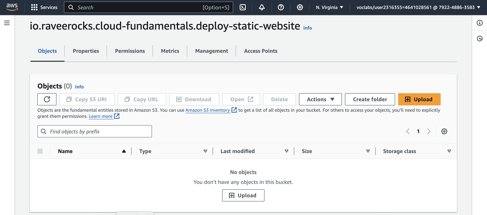
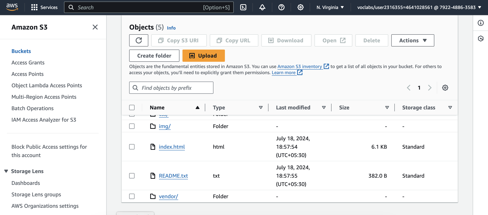
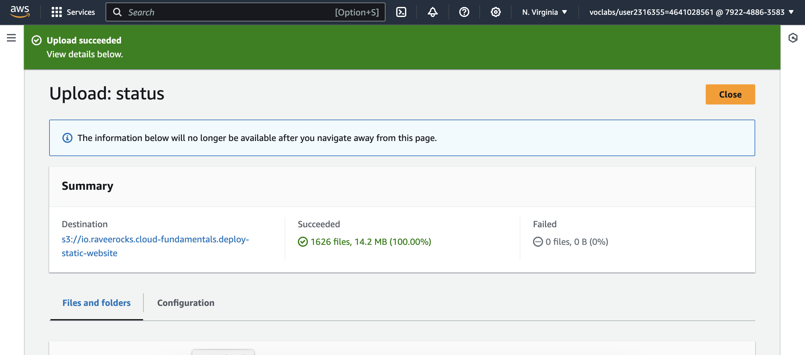
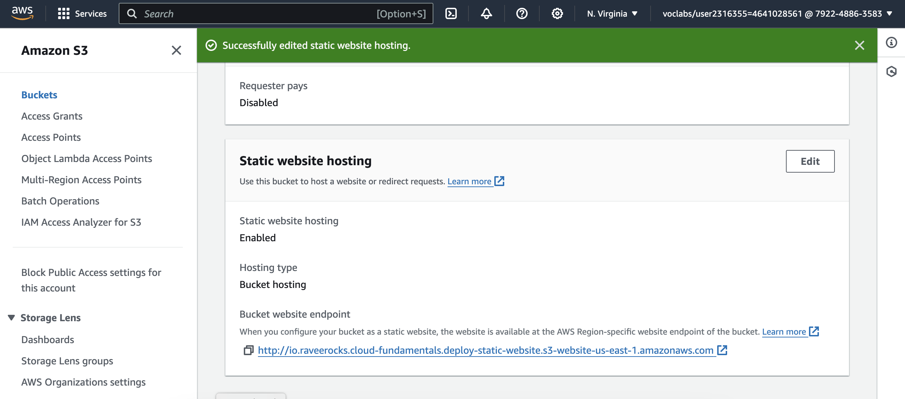
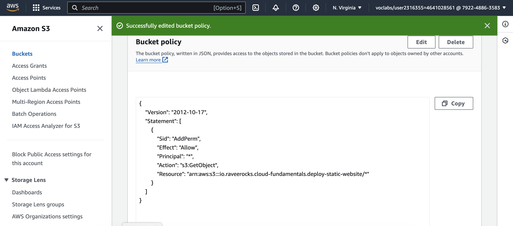
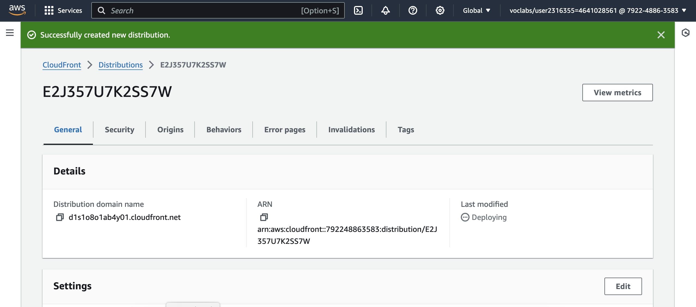
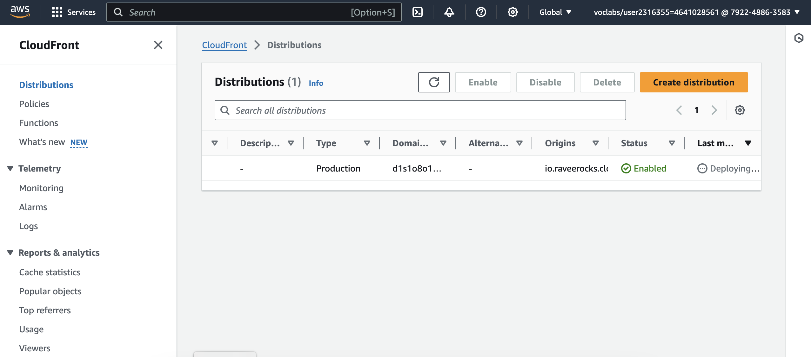
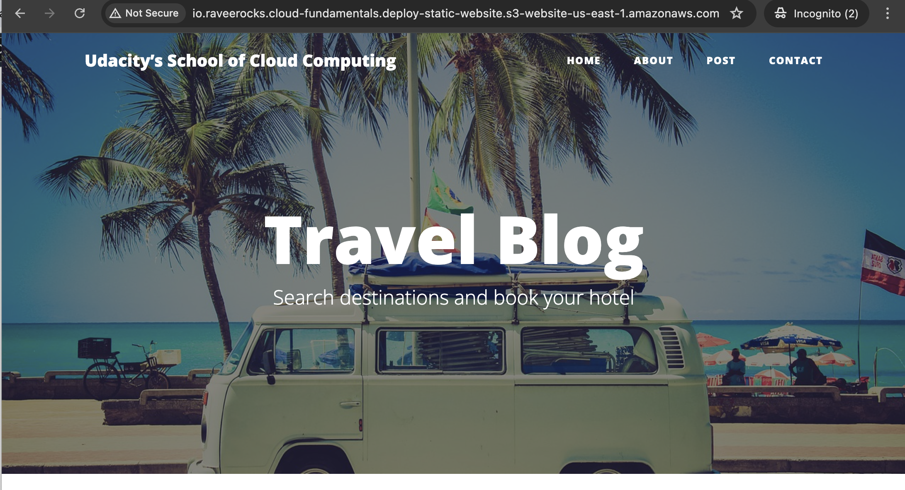

# Project Overview
The cloud is perfect for hosting static websites that only include HTML, CSS, and JavaScript files that require no server-side processing. The whole project has two major intentions to implement:

Hosting a static website on S3 and
Accessing the cached website pages using CloudFront content delivery network (CDN) service. Recall that CloudFront offers low latency and high transfer speeds during website rendering.

```Note that Static website hosting essentially requires a public bucket, whereas the CloudFront can work with public and private buckets.```


In this project, you will deploy a static website to AWS by performing the following steps:

1. You will create a public S3 bucket and upload the website files to your bucket.
1. You will configure the bucket for website hosting and secure it using IAM policies.
1. You will speed up content delivery using AWS’s content distribution network service, CloudFront.
1. You will access your website in a browser using the unique CloudFront endpoint.

## Topics Covered
- S3 bucket creation
- S3 bucket configuration
- Website distribution via CloudFront
- Access website via web browser


#   Submission Requirements

- Created a S3 bucket.



- All website files should be added to the S3 bucket.






- The bucket configuration should be set up to support static website hosting.




- The permission access to the bucket should be configured.




- The website should be distributed via Cloudfront.







- The website publicly accessible
    - Endpoint - http://io.raveerocks.cloud-fundamentals.deploy-static-website.s3-website-us-east-1.amazonaws.com/


